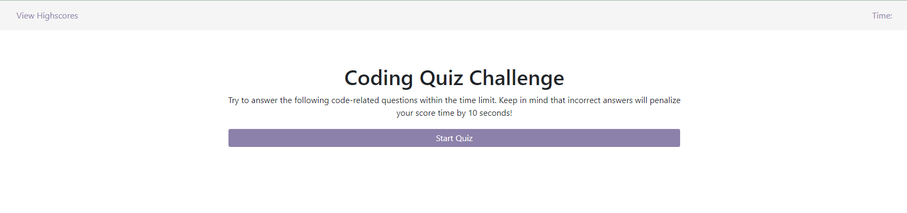
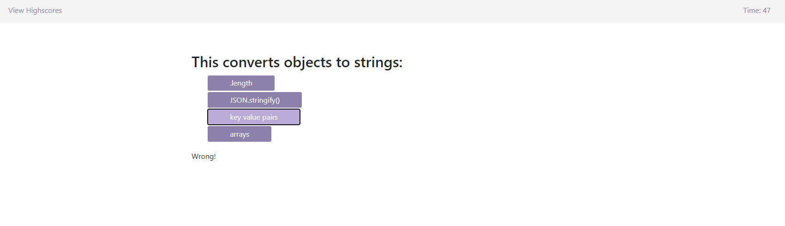
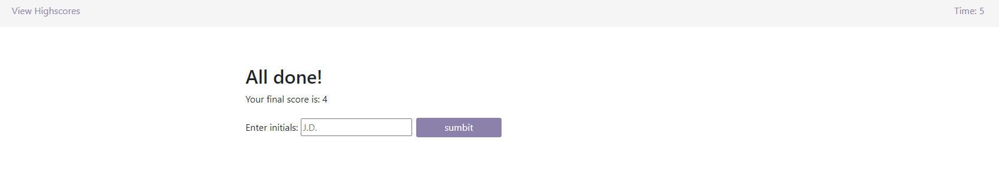
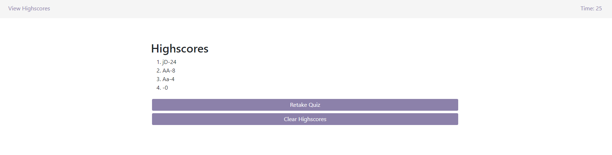

# JavaScript Fundamentals Quiz

## Description

This is a 5 question multiple choice quiz that tests your knowledge of basic JavaScript. Students can use it to learn and have fun competing with others to see who can get the best score.

## Deployed Application

jjocelynn.github.io/javascript-fundamental-quiz

## Usage

Users are met with the starting page that has a "start quiz" button in the center. When the button is pressed, a timer will start in the top right corner that counts down from 60sec.

Simply choose the most correct answer and you will be notified under the multiple choice options whether you were "correct!" or "wrong!." If you choose the wrong answer, 10 seconds will be deducted from the timer.

If you fail to answer all the questions before the timer reaches 0, the quiz will automatically end and you will be prompted to enter your initials with a score of 0.

If you answer all the questions before the countdown ends, you may still enter your initials and your time left will be logged. The higher the score the better!

After submitting your initials, you will be brought to the high scores page (that you can access at anytime in the top left corner).This page logs your initials and score from highest to lowest.
On this page, you have the option to retake the quiz from the start, or to clear your highscores.

## Credits

had help from a tutor (Suresh S Kumar) for the storedHighScore and highscorePage functions.

## License

Please refer to the LICENSE in the repo
